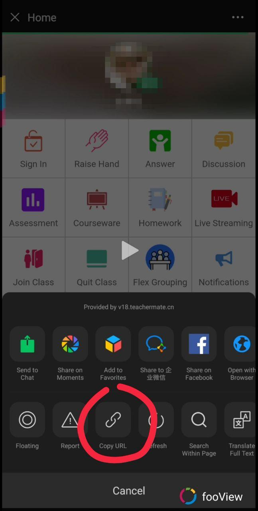
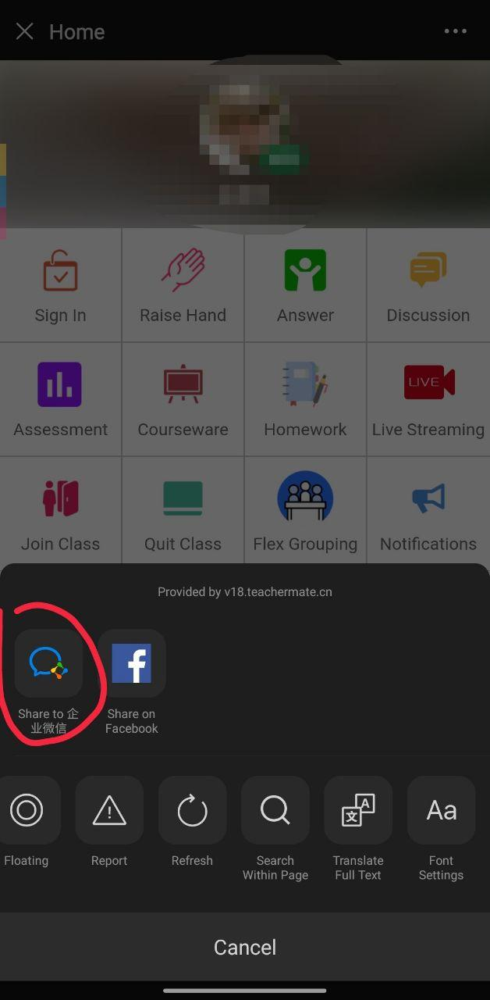
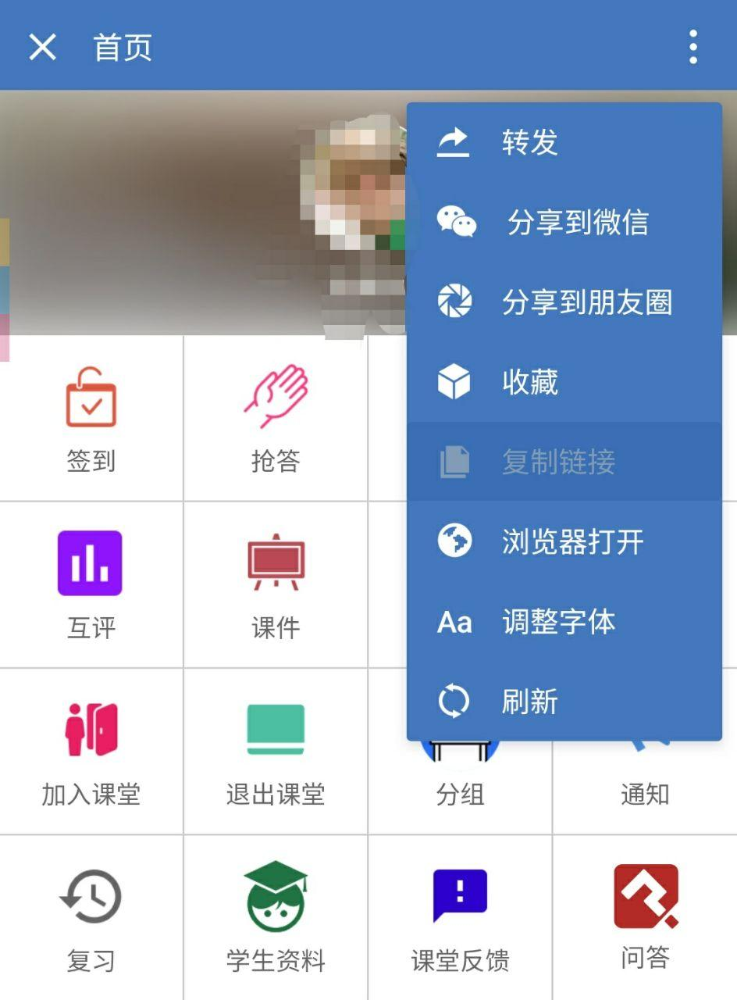

# Acquire Open ID

通过下述方式，你将获得一条带有`openId`字段的URL。你可以将其中的`openId`字段输入至脚本，或直接使用此URL作为脚本的输入。

首先，在*微信*中打开*微助教服务号*。

依次点击*学生(S)*->*签到（或其他任意选项）*。

在新打开的 WebView 中：

### 方法一：拼手速

若你对自己的手速极其自信：

迅速点击右上角，趁未加载完成时点击弹出菜单中的*复制链接*选项。

### 方法二：企业微信

否则：

待页面加载完成后，点击右上角*分享到企业微信*。

在企业微信中打开页面，并点击右上角*复制链接*。

### 方法三：Facebook

对于 Android 的 *Play商店版* 微信和 iOS 非国区微信，可以将页面分享到 Facebook……

